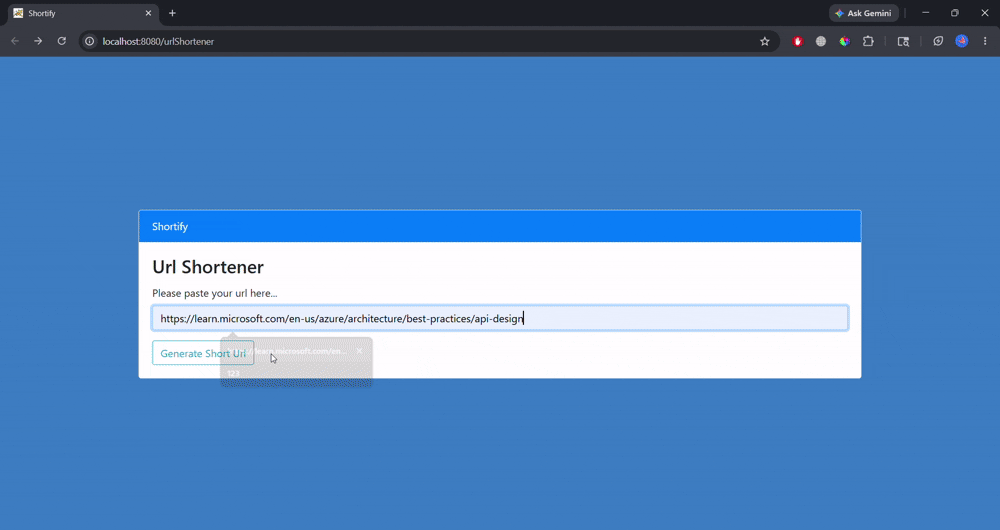
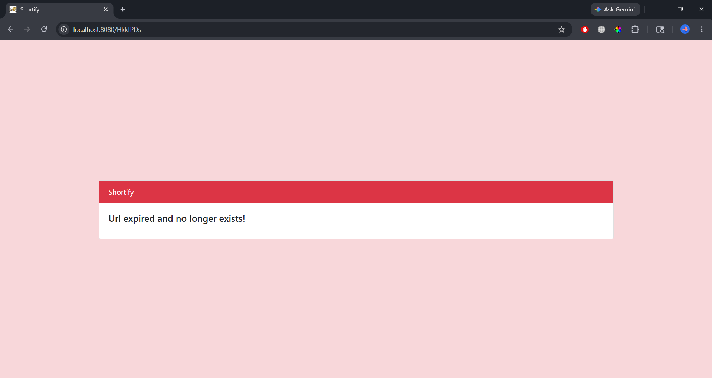
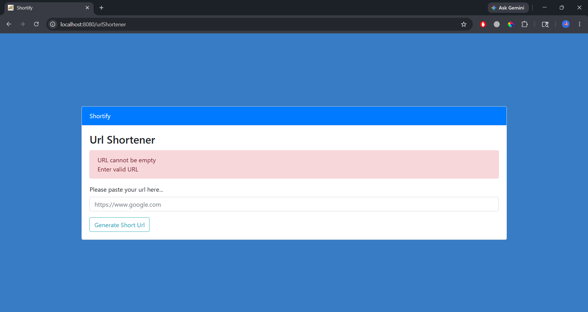

# Shortify 🔗

Shortify is a **URL shortener** web application built using Spring MVC, Hibernate, MySQL, Docker, and Docker Compose.

I built this project to strengthen my understanding of:
- Spring MVC architecture
- layered backend design
- Hibernate/JPA annotations
- URL redirection flow
- validation & exception handling
- Docker containerization
- multi-container orchestration using Docker Compose

This project started as a simple Spring MVC practice application, but gradually evolved into a more production-style backend mini project with expiry handling, click tracking, validation, externalized configuration, and containerized deployment setup.

---

# Features 🚀

- Generate shortened URLs
- Redirect shortened URLs to original URLs
- Random short code generation
- URL expiry support
- Click count tracking
- Backend validation handling
- Error handling for expired/non-existing URLs
- Externalized database configuration
- Dockerized Spring MVC application
- Multi-container setup using Docker Compose

---

# Tech Stack 🛠️

- **Backend**: Java 21, Spring MVC, Hibernate ORM, Maven
- **Database**: MySQL
- **Frontend**: JSP, HTML/CSS
- **Containerization**: Docker, Docker Compose

---

# Project Structure 📁

```text
src/main/java
│
├── controller/      → Handles incoming HTTP requests, redirects, form submissions, and response flow
├── service/         → Contains business logic like short code generation, expiry checks, and click count updates
├── dao/             → Responsible for database operations using Hibernate/JPA
└── model/           → Contains entity classes mapped to database tables
```

---

## Additional Important Directories

```text
src/main/resources
│
├── database.properties     → Externalized database configuration
└── hibernate.cfg.xml       → Hibernate configuration
```

```text
src/main/webapp
│
├── WEB-INF
│   │
│   ├── views/               → JSP pages (UI layer)
│   └── web.xml             → Dispatcher servlet and web application configuration
└── static                  → Static resources like CSS, JS, images (if added later)
```

```text
project-root
│
├── Dockerfile              → Docker image configuration for Spring MVC app
├── docker-compose.yml      → Multi-container orchestration for app + MySQL
├── pom.xml                 → Maven dependencies and build configuration
└── README.md               → Project documentation
```

---

# API Endpoints 🌐

| Method | Endpoint | Description |
|---|---|---|
| GET | `/urlShortener` | Displays the URL shortener homepage/form |
| POST | `/urlShortener` | Accepts original URL, generates short URL, and stores mapping |
| GET | `/{shortUrlCode}` | Redirects user to original URL after expiry validation and click count update |

---

# How It Works ⚙️

## URL Shortening Flow

```text
User submits long URL ➔ Generate random short code ➔ Store mapping ➔ Return shortened URL
```
---

## URL Access Flow

```text
User opens short URL ➔ Look up original URL ➔ Check expiry ➔ Increment click count ➔ Redirect user
```

---

# Validation & Error Handling ✅

I implemented:
- Empty URL validation
- URL pattern validation
- Invalid/non-existing/expired short URL handling

Validation annotations used:
- `@NotBlank`
- `@Pattern`
- `@Valid`

I also learned that:
- `BindingResult` must be used along with `@Valid`
- validation should happen before hitting the database layer

---

# Spring MVC & Hibernate Annotations Used 📚

| Category | Annotations Used |
|----------|------------------|
| MVC Annotations | `@ModelAttribute`, `@PathVariable`, `@RequestMapping`, `@Valid` |
| Dependency Injection & Transaction Management | `@Autowired`, `@Transactional` |
| Hibernate/JPA Annotations | `@Id`, `@Column(nullable = false)`, `@DynamicInsert`, `@ColumnDefault` |
| Stereotype Annotations | `@Controller`, `@Service`, `@Repository`, `@Entity` |

---

# New Things I Learned While Building This Project 🧠

While building this project, I explored and learned several annotations and concepts on the go:

- `@DynamicInsert`
- `@ColumnDefault`
- `@NotBlank`
- `@Pattern`
- `@Valid`
- `BindingResult`
- Externalized configuration using `.properties`
- Docker networking
- Docker volumes
- Docker Compose service orchestration

This project also improved my understanding of:
- MVC request flow
- service-layer business logic
- redirect handling
- backend validation strategy
- containerized application architecture

---

# Docker Learning Journey 🐳

I initially built the application locally using Spring MVC and MySQL.

After the application became stable, I started learning Docker from scratch and gradually containerized the project.

## What I Learned
- Writing Dockerfiles
- Building Docker images (Custom images)
- Running containers
- Port mapping
- Container networking
- Persistent database volumes
- Environment-aware configuration

---

# Docker Compose Setup 🧩

I later added Docker Compose to orchestrate:
- Spring MVC application container
- MySQL container

This helped me understand:
- multi-container applications
- service communication
- centralized container management

The entire application stack can now be started using:

```bash
docker-compose up
```

---

# Running The Project Locally ▶️

## Clone Repository

```bash
git clone <your_repo_url>
```

---

## Start Containers

```bash
docker-compose up --build
```

---

## Access Application

```text
http://localhost:8080
```

---

# Future Improvements 🌱

Possible future enhancements:
- Redis caching
- QR code generation
- Custom aliases
- Analytics dashboard
- Async click tracking
- Rate limiting

---

# Screenshots 📸







---

# Author 👨‍💻
Built by Ojaswi Deshmukh as a backend-focused Spring MVC learning project.